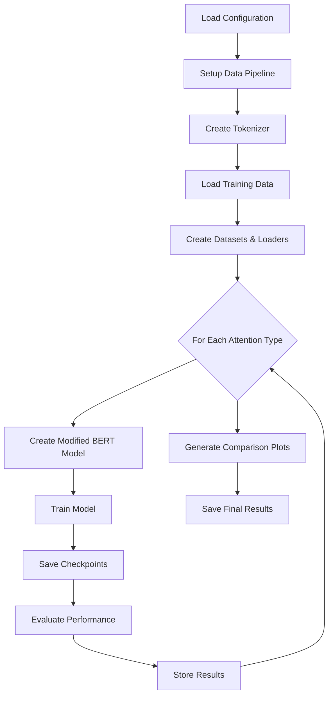

# Project Structure and Architecture Explanation

## Overview
This document provides a comprehensive explanation of the overall project structure and architecture for the BERT attention mechanism comparison implementation. The project compares different attention mechanisms (Standard, RoPE, ExpoSB, and Absolute) using Triton kernels for performance optimization.

## Project Directory Structure

```
integrated_implementation/
├── explanations/                          # Documentation folder
│   ├── triton_kernel_explanation.md       # Detailed Triton kernel explanations
│   └── project_structure_explanation.md   # This file
├── attention_implementation/               # Core attention implementations
│   ├── triton_standard_attention.py       # Standard BERT attention with Triton
│   ├── triton_rope_attention.py          # RoPE attention with Triton
│   ├── triton_exposb_attention.py        # ExpoSB attention with Triton
│   └── triton_absolute_attention.py       # Absolute position attention with Triton
├── training_data/                         # Training data directory
│   ├── Adventures-of-Huckleberry-Finn_76-master/
│   │   └── 76.txt                         # Source text for training
│   └── processed_training_data.txt        # Preprocessed training chunks
├── local_tokenizer/                       # Local tokenizer files
│   └── vocab.txt                          # BERT vocabulary
├── bert_config.py                         # Configuration management
├── data_preprocessing.py                  # Data preprocessing utilities
├── integrated_bert_comparison.py          # Main training and comparison script
├── setup_tokenizer.py                     # Tokenizer setup utilities
├── training_data.txt                      # Simple training data file
├── config.env                            # Environment configuration
└── README.md                             # Project documentation
```

## Core Architecture Components

### 1. Configuration Management (`bert_config.py`)

**Purpose**: Centralized configuration management using environment variables and dataclasses.

**Key Features**:
- **Dataclass-based configuration** for type safety and documentation
- **Environment variable support** via `config.env` file
- **Default values** for all configuration parameters
- **Validation and type conversion** utilities

**Configuration Categories**:
```python
@dataclass
class BERTComparisonConfig:
    # Model Configuration
    vocab_size: int = 30522
    hidden_size: int = 768
    num_hidden_layers: int = 6
    num_attention_heads: int = 12
    
    # Training Configuration
    batch_size: int = 32
    learning_rate: float = 5e-5
    num_epochs: int = 50
    
    # Attention Types to Compare
    attention_algorithms: str = "standard,rope,exposb,absolute"
```

### 2. Data Preprocessing (`data_preprocessing.py`)

**Purpose**: Robust text processing pipeline for BERT pretraining data.

**Key Components**:

#### Text Cleaning Pipeline
```python
def clean_gutenberg_text(text: str) -> str:
    # Remove Project Gutenberg headers/footers
    # Normalize formatting and whitespace
    # Extract main content
```

#### Intelligent Chunking Strategy
```python
def split_into_training_chunks(text: str, target_length: int = 200, overlap: int = 30):
    # Sentence-aware splitting
    # Overlapping chunks for context continuity
    # Adaptive chunk sizing
```

**Features**:
- **Project Gutenberg support**: Automatic header/footer removal
- **Sentence-aware chunking**: Preserves linguistic boundaries
- **Overlapping chunks**: Maintains context across boundaries
- **Configurable parameters**: Chunk size and overlap control
- **Robust error handling**: Fallback datasets for missing files

### 3. Attention Implementation Architecture

#### Common Interface Pattern
All attention implementations follow a consistent interface:

```python
class AttentionMechanism(torch.nn.Module):
    def __init__(self, hidden_size, num_heads, max_position_embeddings, dropout):
        # Initialize linear projections
        # Setup position embedding strategy
        # Configure dropout and normalization
    
    def forward(self, hidden_states, attention_mask=None, **kwargs):
        # Input processing and position encoding
        # Attention computation (via Triton kernels)
        # Output projection and dropout
        return (output,)  # BERT-compatible interface
```

#### Attention Type Comparison

| Attention Type | Position Encoding | Memory Usage | Computational Complexity |
|----------------|------------------|--------------|-------------------------|
| **Standard** | Absolute embeddings added to input | High (position table) | O(n²d + nd_pos) |
| **RoPE** | Rotary encoding in Q,K | Low (no position table) | O(n²d + nd_rot) |
| **ExpoSB** | Exponential spacing with bias | Medium | O(n²d + n) |
| **Absolute** | Traditional sinusoidal | Medium | O(n²d + nd_pos) |

### 4. Main Training Loop (`integrated_bert_comparison.py`)

**Purpose**: Orchestrates the entire comparison experiment across different attention mechanisms.

#### Architecture Flow



#### Model Architecture Modification

```python
class ModifiedBERTModel(BertForMaskedLM):
    def __init__(self, config, attention_type="standard"):
        super().__init__(config)
        
        # Replace attention layers based on type
        for layer in self.bert.encoder.layer:
            if attention_type == "standard":
                layer.attention.self = StandardBERTAttention(...)
            elif attention_type == "rope":
                layer.attention.self = RoPEBERTAttention(...)
            # ... other attention types
```

#### Training Pipeline Features

1. **Mixed Precision Training**: FP16 support for memory efficiency
2. **Gradient Accumulation**: Handle large effective batch sizes
3. **Learning Rate Scheduling**: Warmup and decay strategies
4. **Checkpoint Management**: Automatic saving and resuming
5. **Validation Tracking**: Regular evaluation on held-out data
6. **Memory Management**: Efficient GPU memory usage

### 5. Triton Kernel Integration

#### Kernel-PyTorch Interface
```python
class AttentionFunction(torch.autograd.Function):
    @staticmethod
    def forward(ctx, q, k, v, causal, sm_scale):
        # Launch Triton kernel
        _attention_fwd_kernel[grid](q, k, v, ...)
        return output
    
    @staticmethod
    def backward(ctx, grad_output):
        # Gradient computation (fallback to PyTorch for stability)
        return gradients
```

#### Memory Layout Optimization
- **Block-based processing**: Efficient memory access patterns
- **Shared memory utilization**: Automatic optimization by Triton
- **Coalesced memory access**: Row/column-major access patterns
- **Mixed precision support**: FP16/FP32 hybrid computation

## Data Flow Architecture

### 1. Data Ingestion Pipeline

```
Raw Text → Cleaning → Chunking → Tokenization → DataLoader → Model
```

#### Processing Steps:
1. **Text Cleaning**: Remove headers, normalize formatting
2. **Intelligent Chunking**: Sentence-aware splitting with overlap
3. **Tokenization**: BERT wordpiece tokenization
4. **MLM Masking**: Dynamic masked language modeling
5. **Batch Processing**: Efficient batching with padding

### 2. Model Training Pipeline

```
Input Batch → Embedding → Attention Layers → MLM Head → Loss → Backprop
```

#### Attention Layer Detail:
```
Hidden States → Position Encoding → Q/K/V Projection → Triton Attention → Output Projection
```

### 3. Evaluation and Comparison Pipeline

```
Training Histories → Loss Analysis → Performance Metrics → Visualization → Final Report
```

## Performance Optimization Strategies

### 1. Memory Optimization
- **Gradient Checkpointing**: Trade compute for memory
- **Mixed Precision**: FP16 for forward, FP32 for gradients
- **Efficient Data Loading**: Optimized batch processing
- **Memory Pooling**: Reuse allocated tensors

### 2. Computational Optimization
- **Triton Kernels**: Custom GPU kernels for attention
- **Block-level Processing**: Minimize memory transfers
- **Operator Fusion**: Combine operations in single kernels
- **Autograd Optimization**: Efficient gradient computation

### 3. Training Efficiency
- **Gradient Accumulation**: Simulate larger batch sizes
- **Learning Rate Scheduling**: Optimal convergence
- **Early Stopping**: Prevent overfitting
- **Checkpoint Resuming**: Fault tolerance

## Modularity and Extensibility

### 1. Plugin Architecture
New attention mechanisms can be easily added:
```python
# 1. Implement attention class with standard interface
class NewAttentionMechanism(torch.nn.Module):
    def forward(self, hidden_states, **kwargs):
        # Custom implementation
        return (output,)

# 2. Add to model factory
elif attention_type == "new_mechanism":
    layer.attention.self = NewAttentionMechanism(...)

# 3. Update configuration
attention_algorithms: str = "standard,rope,exposb,absolute,new_mechanism"
```

### 2. Configuration Flexibility
- **Environment-based config**: Easy deployment across environments
- **Hierarchical defaults**: Override only what you need
- **Type safety**: Dataclass validation
- **Documentation**: Self-documenting configuration

### 3. Testing and Validation
- **Unit tests**: Individual component testing
- **Integration tests**: End-to-end validation
- **Performance benchmarks**: Regression testing
- **Numerical stability**: Gradient checking

## Error Handling and Robustness

### 1. Data Pipeline Robustness
- **Missing file handling**: Fallback to default datasets
- **Encoding error handling**: Graceful degradation
- **Memory error recovery**: Adaptive batch sizing
- **Validation data availability**: Optional validation

### 2. Training Robustness
- **NaN detection**: Early stopping on numerical issues
- **Gradient clipping**: Prevent exploding gradients
- **Checkpoint recovery**: Resume from failures
- **Device availability**: Automatic CPU/GPU selection

### 3. Kernel Stability
- **Fallback implementations**: PyTorch alternatives
- **Numerical stability**: Safe mathematical operations
- **Shape validation**: Input tensor verification
- **Device compatibility**: Multi-GPU support

## Monitoring and Logging

### 1. Training Metrics
- **Loss tracking**: Training and validation curves
- **Learning rate monitoring**: Schedule visualization
- **Gradient statistics**: Norm and histogram tracking
- **Memory usage**: GPU utilization monitoring

### 2. Performance Metrics
- **Training speed**: Tokens per second
- **Memory efficiency**: Peak memory usage
- **Model quality**: Perplexity and accuracy
- **Convergence**: Loss reduction rate

### 3. Comparison Analytics
- **Relative performance**: Cross-algorithm comparison
- **Statistical significance**: Confidence intervals
- **Computational efficiency**: Speed vs accuracy tradeoffs
- **Resource utilization**: Memory and compute efficiency

## Future Extensions

### 1. Additional Attention Mechanisms
- **Sparse Attention**: Linear attention variants
- **Local Attention**: Window-based mechanisms
- **Adaptive Attention**: Dynamic attention patterns
- **Hierarchical Attention**: Multi-scale processing

### 2. Advanced Training Techniques
- **Knowledge Distillation**: Teacher-student training
- **Curriculum Learning**: Progressive difficulty
- **Multi-task Learning**: Joint objective optimization
- **Federated Learning**: Distributed training

### 3. Deployment Optimizations
- **Model Quantization**: Int8/Int4 inference
- **ONNX Export**: Cross-platform deployment
- **TensorRT Integration**: Optimized inference
- **Mobile Deployment**: Edge device optimization

This architecture provides a solid foundation for comparing different attention mechanisms while maintaining flexibility for future research and development.