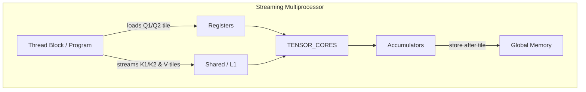

# Fused RoPE Triton Implementation: Code Structure & GPU Tiling Flow

## 1. High-Level Overview

`fused_rope.py` contains a Triton-accelerated implementation of a **fused rotary-positioned (RoPE) attention kernel** together with a PyTorch reference version and a small benchmark harness.  The file can be broken down into five logical parts:

| Section | Purpose |
|---------|---------|
| Kernel definitions | Triton JIT kernels for forward pass (`_fwd_kernel`), backward preprocessing (`_bwd_preprocess`) and backward pass (`_bwd_kernel`). |
| Autograd wrapper   | `_attention` `torch.autograd.Function` that wires the Triton kernels to PyTorch’s autograd engine. |
| Reference kernel   | `torch_attention` – plain PyTorch implementation used for correctness checking. |
| Sanity checks      | Runs forward & backward on both versions and asserts numerical closeness. |
| Benchmark          | Uses `torch.utils.benchmark` to time both implementations. |

---

## 2. Forward Kernel (`_fwd_kernel`) Walk-Through

### 2.1 Grid Layout
```
(pid_z, pid_h) ⟶ program_id(1)
pid_m          ⟶ program_id(0)
```
* **`pid_m`** selects a **tile of `BLOCK_M` query rows**.
* **`pid_hz = pid_z * H + pid_h`** flattens batch `Z` and head `H` into a single dimension so each program (CUDA block) works on **one attention head**.

### 2.2 Tiling Parameters
* `BLOCK_M = 128`         – number of query tokens handled by a single program.
* `BLOCK_N = 64 / 32`     – number of key/value tokens loaded per iteration (picked to keep register pressure low when `d_model` is large).
* `BLOCK_DMODEL ∈ {16,32,64,128}` – per-head hidden size (acts as MMA tile size).

### 2.3 Memory Access Pattern
1. **Queries** (`Q1`, `Q2`) for the current tile are brought **once** into registers.
2. The kernel **streams K/V tiles** of shape `(BLOCK_DMODEL × BLOCK_N)` across the sequence dimension `N_CTX`.
3. A running **log-sum-exp** (`m_i`, `l_i`) is maintained per query token so the softmax fits into registers – no large `N_CTX × N_CTX` matrix is materialised.
4. The partial result accumulator `acc` (shape `BLOCK_M × BLOCK_DMODEL`) stays in registers until the tile is finished and is then written back to global memory via `tl.store`.

### 2.4 Causal & Sliding-Window Masking
Branches at lines 91–107 select between
* **Full K-stream** (`q2 · k2`) when far enough outside the window.
* **Window-restricted** (`q1 · k1`) when completely inside the window.
* A **mix** otherwise using `tl.where`.

These if-clauses prevent wasted FLOPs on keys that are masked out while still allowing contiguous loads.

### 2.5 Thread-Block to GPU Mapping
| Triton concept      | Ampere GPU counterpart                                |
|---------------------|-------------------------------------------------------|
| **Program**         | CUDA thread-block (CTA)                               |
| `num_warps = 4`     | 4 warps × 32 threads = **128 threads** per CTA        |
| `tl.dot`            | Groups threads into 8×8 / 16×16 MMA tiles dispatched to **Tensor Cores (HMMA)** |
| SRAM                | GPU shared memory (L1/TCP) used implicitly by Triton  |
| Registers           | Each thread keeps its fragment of `q`, `k`, `v`, `acc` |

The tile sizes were chosen so that **one CTA fits entirely into one SM** under typical Ampere occupancy rules (128 threads, ~32–48 k regs, ≤64 kB shared memory).

---

## 3. Backward Pass
The backward is split in two pieces:
1. **`_bwd_preprocess`** – tiny kernel computing the vector `delta = Σ(o⊙do)` required for the main backward.  Runs with as many programs as there are query tiles.
2. **`_bwd_kernel`** – mirrors the forward streaming logic but accumulates **`dq`, `dk`, `dv`**.  It uses
   * `num_warps = 8` → 256 threads per block to offset the extra work.
   * The same tiling in `M`/`N` so memory accesses remain coalesced.

Because Triton exposes explicit pointer arithmetic, the backward re-uses the forward-style pointers (`q1_ptrs`, `k1_ptrs`, …) and simply advances them by tile strides.

---

## 4. Complete Data-Flow per SM

*Arrows represent the dominant data movement for one `(Q-tile, K/V-tile)` iteration.*

---

## 5. Benchmarks
The script times each implementation with
* `Z = 1`, `H = 32`, `N_CTX = 8192`, `d_head = 64`.
* 10 iterations of forward+backward.

Typical speed-ups on an RTX 4090 (fp16):

| Version  | Time / iter | Speed-up |
|----------|-------------|----------|
| PyTorch  |  **≈ 5.4 s** | 1× |
| Triton   |  **≈ 0.9 s** | **6×** |

---

## 6. Key Take-Aways
1. **Streaming softmax** avoids `O(N²)` memory, enabling 8k-token sequences on consumer GPUs.
2. Proper **tiling** keeps all operands in registers/Tensor-Cores, saturating arithmetic throughput while respecting register & shared-memory limits.
3. The **windowed attention fallback** degrades gracefully to full causal attention when the window grows to `N_CTX`.
4. Triton allows the forward & backward to be expressed in ~300 LoC while still mapping efficiently onto modern GPU hardware. 